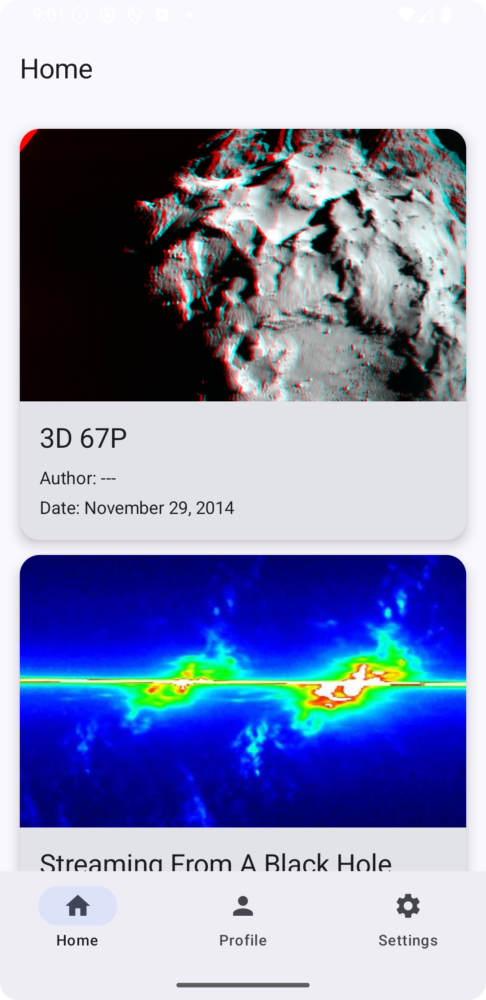
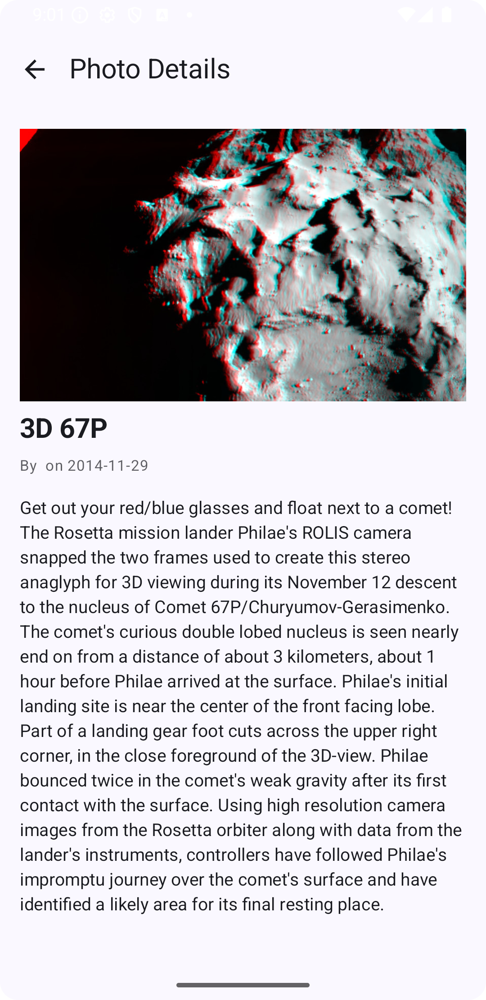
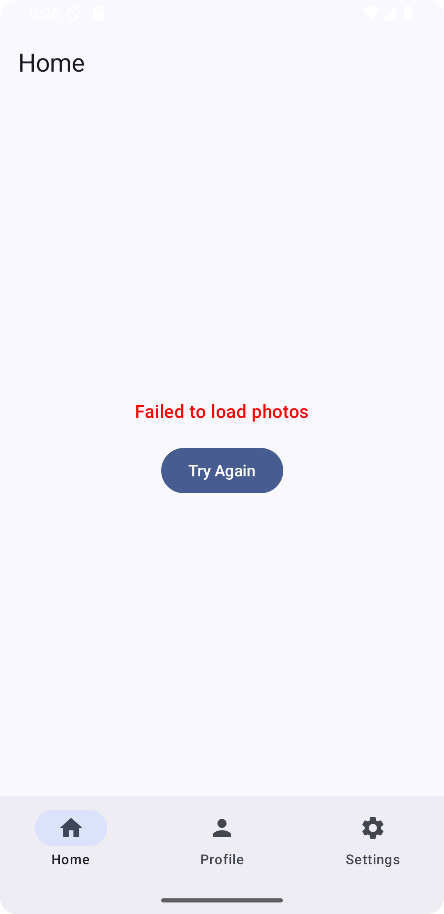

# NASA Photos App

This is a small Android project that fetches and displays a collection of photos from the [NASA API](https://api.nasa.gov/).

## What’s Included
- ✅ Displays photo **image, title, author, and date**
- ✅ Details page when a card is tapped, showing image, full description, author, and date
- ✅ **Swipe-to-refresh** to reload new photos
- ✅ Built with **MVVM architecture** using Kotlin + Jetpack Compose
- ✅ **Modern UI** with Material 3
- ✅ **Unit tests** included
- ✅ **Bottom navigation** to switch between different pages

## Tech Stack
- **UI:** Jetpack Compose + Material3
- **Architecture:** MVVM
- **Networking:** Retrofit + OkHttp
- **Image Loading:** Coil
- **DI:** Koin
- **Testing:** JUnit + MockK

## Highlights
- Uses NASA’s free photo API
- Clean, modern Android app structure
- Implements both required features and “nice-to-have” extras
- Includes photo details screen with back navigation

## Screenshot
| Home Screen | Details Screen | Error Screen                                           |
|------------|----------------|--------------------------------------------------------|
|  |  |  |

⚠️ Note: The API key is currently exposed in this repository for demonstration purposes.  
It will be hidden (using local.properties or environment variables) once the project is reviewed.
